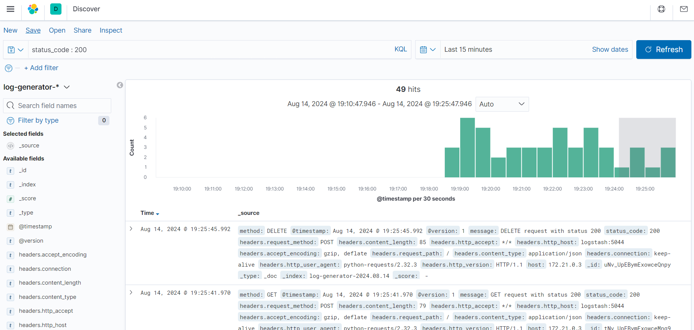

# Log Generator Stack ELK


## Sumário

- [Introdução](#introdução)
- [Requisitos Mínimos](#requisitos-mínimos)
- [Script para Instalar o Docker](#script-para-instalar-o-docker)
- [Como Subir os Serviços](#como-subir-os-serviços)
- [Descrição da Aplicação Geradora de Logs](#descrição-da-aplicação-geradora-de-logs)
- [Verificação dos Logs](#verificação-dos-logs)
- [Acesso ao Kibana](#acesso-ao-kibana)
- [Informações Adicionais](#informações-adicionais)

## Introdução

Este projeto configura uma pilha ELK (Elasticsearch, Logstash, Kibana) para coletar, processar e visualizar logs gerados por uma aplicação Python.

## Requisitos Mínimos

- Docker versão 20.10.8 ou superior
- Docker Compose versão 1.29.2 ou superior
- Recursos de hardware recomendados:
  - CPU: 2 cores
  - Memória: 4 GB

### Script para Instalar o Docker

Para facilitar a instalação do Docker na versão específica necessária, você pode usar o script `install_dependencies.sh`. Este script verifica a versão atual do Docker e instala a versão correta, se necessário.

#### Como usar o script

1. Baixe ou clone este repositório.
2. Navegue até o diretório raiz do projeto.
3. Execute o script usando o seguinte comando:

   ```bash
   # No linux
   chmod +x install_dependencies.sh

   ./install_dependencies.sh
## Como Subir os Serviços

1. **Clone o repositório:**

   ```bash
   git clone https://github.com/VitorHmaia/devops-stack-elk.git

   cd devops-stack-elk

2. Configure variáveis de ambiente: (opcional se necessário)

    - Arquivo `.env`:
    ```bash
    # Elasticsearch
    ELASTICSEARCH_VERSION=7.9.1
    ELASTICSEARCH_CLUSTER_NAME=elasticsearch
    ELASTICSEARCH_DISCOVERY_TYPE=single-node
    ELASTICSEARCH_HTTP_HOST=0.0.0.0
    ELASTICSEARCH_TRANSPORT_HOST=0.0.0.0
    ELASTICSEARCH_BOOTSTRAP_MEMORY_LOCK=true
    ELASTICSEARCH_XPACK_SECURITY_ENABLED=false
    ELASTICSEARCH_XPACK_MONITORING_ENABLED=false

    # Logstash
    LOGSTASH_VERSION=7.9.1

    # Kibana
    KIBANA_VERSION=7.9.1
    KIBANA_ELASTICSEARCH_URL=http://elasticsearch:9200
    KIBANA_ELASTIC_PASSWORD=password

    # Log Generator
    LOG_GENERATOR_IMAGE=log-generator
    LOG_GENERATOR_PORT=5000
    ```

3. Suba os serviços com Docker Compose:
   ```bash
   docker-compose up -d
Isso irá iniciar os contêineres para Elasticsearch, Logstash, Kibana e a aplicação geradora de logs.

## Descrição da Aplicação Geradora de Logs

A aplicação geradora de logs é um script Python que cria logs simulando requisições de API em intervalos de 2 segundos. Os logs incluem informações como método HTTP, código de status e cabeçalhos da requisição. Esses logs são enviados para o Logstash para processamento.

Na essência, a aplicação consiste na utilização de um array de logs que são enviados de forma aleatória, como segue o código abaixo:

```python
def generate_random_log():
    methods = ['GET', 'POST', 'PUT', 'DELETE']
    status_codes = [200, 201, 400, 404, 500]
    method = random.choice(methods)
    status_code = random.choice(status_codes)
    message = f'{method} request with status {status_code}'
    return method, status_code, message

```

## Verificação dos Logs

Para verificar se os logs estão sendo gerados e processados corretamente:

1. **Verifique o conteúdo do arquivo de logs:**

   ```bash
   cat log-generator/logs/app.log
2. **Consultar o Elasticsearch:**
   ```bash
   curl -X GET "localhost:9200/log-generator-*/_search?pretty"
   ```
   Retorno esperado:
   ```bash
         {
        "_index" : "log-generator-2024.08.14",
        "_type" : "_doc",
        "_id" : "F9v5UpEBymExowceJnlv",
        "_score" : 1.0,
        "_source" : {
          "method" : "POST",
          "@timestamp" : "2024-08-14T22:19:05.604Z",
          "@version" : "1",
          "message" : "POST request with status 404",
          "status_code" : 404,
          "headers" : {
            "request_method" : "POST",
            "content_length" : "81",
            "http_accept" : "*/*",
            "http_host" : "logstash:5044",
            "accept_encoding" : "gzip, deflate",
            "request_path" : "/",
            "content_type" : "application/json",
            "connection" : "keep-alive",
            "http_user_agent" : "python-requests/2.32.3",
            "http_version" : "HTTP/1.1"
          }
   ```

## Acesso ao Kibana

1. Abra o Kibana em seu navegador:

   - URL: [http://localhost:5601](http://localhost:5601)

2. Configure um padrão de índice:

   - Vá para **Stack Management > Index Patterns**.
   - Crie um novo padrão de índice com `log-generator-*`.
   - Defina `@timestamp` como o campo de tempo.

3. Visualize os logs:

   - Navegue até **Discover**.
   - Selecione o padrão de índice `log-generator-*` para visualizar os logs.

No exemplo abaixo, os logs foram filtrados com base no seu `status`, buscando apenas os que resultaram em 200 (OK):



### Usando o Kibana Discover

1. **Acesse o Kibana Discover:**
   - Abra o Kibana em seu navegador.
   - Vá para a seção **Discover**.

2. **Selecione o Padrão de Índice:**
   - Escolha o padrão de índice que você criou para seus logs, como `log-generator-*`.

3. **Defina o Intervalo de Tempo:**
   - No canto superior direito, selecione o intervalo de tempo para os logs que você deseja analisar.

4. **Filtre e Consulte:**
   - Para calcular percentis, utilize o recurso **Visualize** do Kibana em vez de consultas manuais.

### Usando o Kibana Visualize

1. **Crie uma Nova Visualização:**
   - Vá para a seção **Visualize** e clique em **Criar uma nova visualização**.

2. **Escolha o Tipo de Visualização:**
   - Selecione **Metric** ou **TSVB (Time Series Visual Builder)** para análise de séries temporais.

3. **Selecione sua Fonte de Dados:**
   - Escolha o padrão de índice apropriado, como `log-generator-*`.

4. **Configure sua Consulta:**
   - Use as opções no editor de visualização para adicionar métricas. Para calcular percentis, use as seguintes configurações:

   - **Para Percentis (90º, 99º)**:
     - Escolha **Percentis** nas métricas.
     - Selecione o campo para o qual você deseja calcular os percentis (por exemplo, `status_code` ou um campo numérico personalizado).
     - Insira os percentis desejados, por exemplo, `90, 99`.

5. **Salve e Adicione ao Dashboard:**
   - Salve sua visualização e adicione-a a um dashboard, se necessário.

### Exemplos de Consultas

Aqui estão exemplos de consultas para usar no Kibana Visualize ou TSVB:

#### Consulta para Percentis de Tempo de Resposta (90º e 99º)
```json
{
  "aggs": {
    "response_time_percentiles": {
      "percentiles": {
        "field": "response_time", // substituir pelo campo apropriado em seus logs
        "percents": [90, 99]
      }
    }
  }
}
